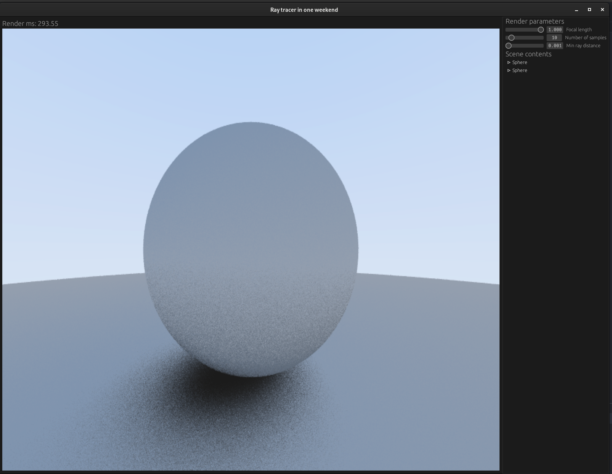

## Raytracing in one week

This is Rust implementation of : https://raytracing.github.io/books/RayTracingInOneWeekend.html

Used crates:
- egui & eframe for UI
- rand for random number generators

### Current state of the project
- Paragraph 8 is fully implemented

### Screenshot:


### Todo:
- implementation of the materials
- Move renderer to separate thread
- Split rendering to multiple cores
- Optimizations in vector math
- cleanup in module structure
- release binaries

### How to build
```shell
git clone https://github.com/jakudlaty/raytracer.git
cd raytracer
cargo run --release
```

### Literature (free interesting books)
- https://raytracing.github.io/
- https://www.pbr-book.org/